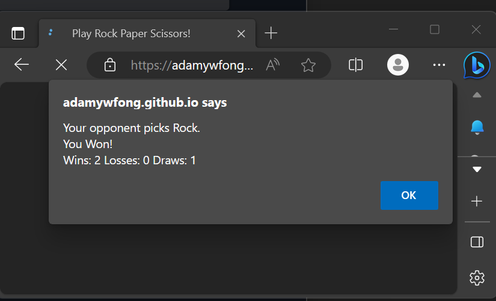

# Rock-Paper-Scissors

## Description

Simple implementation of Rock Paper Scissors made using Javascript. Designed to practice using basic Javascript concepts, including iteration, functions, array and matrix operations, and prompt(), alert(), and confirm() prompts.

Site link: [https://adamywfong.github.io/rock-paper-scissors/](https://adamywfong.github.io/rock-paper-scissors/)

## Usage

Upon opening of websites, enter R/P/S selection into prompt and click okay to play.
The number of wins/losses/draws are tracked as long as you continue to play.
Press cancel at anytime to quit playing.
Reload website to play again after cancelling.
